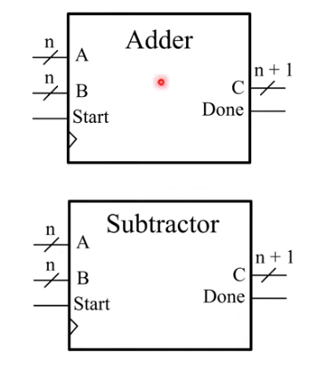
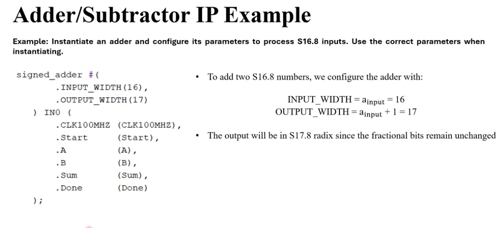
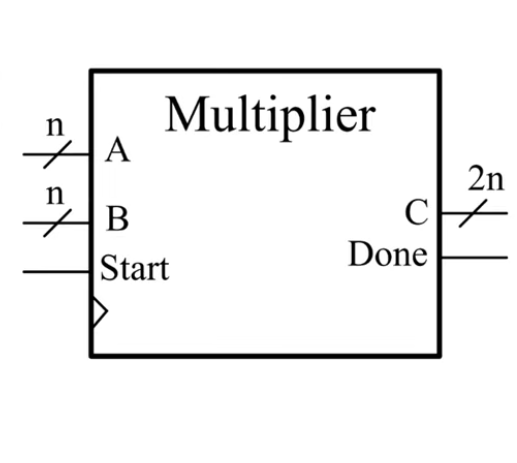

# FPGA

# [Mastering Verilog: Advanced FPGA Design Course Overview & Student Guide Emilio Martinez III](https://www.youtube.com/watch?v=5cQPkQr7GQQ&list=PLfPwG72dAOx6gkqrrZVdr63EaizecO0Cg)  


[01-Mastering Verilog: Advanced FPGA Design Course Overview & Student Guide](https://www.youtube.com/watch?v=5cQPkQr7GQQ&list=PLfPwG72dAOx6gkqrrZVdr63EaizecO0Cg&index=2)  

[02-Is This FPGA / ASIC Course Right for You? | Full Course Overview Emilio Martinez III](https://www.youtube.com/watch?v=NmxBzMaN0lg&list=PLfPwG72dAOx6gkqrrZVdr63EaizecO0Cg&index=2)  

[03-Fixed-Point Arithmetic in Verilog (Complete S(a.b)/U(a.b) Guide + Python Converter)](https://www.youtube.com/watch?v=6UHiis-zBYE&list=PLfPwG72dAOx6gkqrrZVdr63EaizecO0Cg&index=3)  

[04-Industrial-Grade Arithmetic IP Cores in Verilog Emilio Martinez III](https://www.youtube.com/watch?v=xt3aIYz8FiE&list=PLfPwG72dAOx6gkqrrZVdr63EaizecO0Cg&index=4)   

---

# [04-Industrial-Grade Arithmetic IP Cores in Verilog Emilio Martinez III](https://www.youtube.com/watch?v=xt3aIYz8FiE&list=PLfPwG72dAOx6gkqrrZVdr63EaizecO0Cg&index=4)   

Lesson Overview

Go over Arithmetic IP Blocks

- Adder/Subtractor
- Multiplier
- Divider

Verilog IP design methods used

- Fixed-point-safe addition and subtraction
- Why latency and bit-width are handled explicitly

Design custom math

- Instantiating the IP Blocks
- multiple examples & Simulation


In school, you likely learned about common arithmetic circuits, things like: 

- ripple carry adders
- CLA (Carry Lookahead Adder)
- array multipliers

The reality is that those arithmetic modules in their current format are not usable in complex systems.
The reason is that these implementation provide no control over when the result is stable and ready to use.

To make an arithmetic module usable, **you need to control when the calculation starts (and ends)**. 
It is necessary to make these implementation timing-aware by combining them with some sequential 
control logic into a handshake-based module. In practice, control pulses are added to the basic 
implementation to control when the computational block should read its impunts and when the cascaded
block should read its input, that is the output of the added block.

The image below shows how all arithmetic IP cores from the book behave.

The arithmetic module receives a Start pulse, updates its output, and finally asserts a Done pulse sometime later.
This behavior allows for timing errors to be removed since downstream modules only use the result once the 
done pulse is received. Since the done pulse was intentionally made to happen way after the original calculation, 
timing issues are impossible.

> Practice Tip:

This way to modify basic circuits adding timing-aware blocks in Verilog is **standard practice**.
It is always very easy to modify the Verilog code to trim the timing to suit the specific application.


##  Adder and Subtractor IP Summary

The adder and subtractor can add S(a.b), U(a.b), S(a), and U(a) numbers. 

They both have two parameters. 
To ensure no precision or overflow errors come, always use these values when instantiating the IP blocks:



- INPUT_WIDTH = ainput
- OUTPUT_WIDTH = ainput + 1

Assuming you followed step 1, the following is always true of the output format:

- aoutput = ainput + 1
- boutput = binput




##  Verilog Multiplier

The multiplier can only multiply S(a.b) numbers, so all inputs must be converted into S(a.b) before operation. 
The multiplier has three parameters. 
To ensure no precision or overflow errors come, always use these values when instantiating the IP block:

DATA_WIDTH = ainput
FRACTION = binput
OUT_WIDTH = 2 * ainput

Note that with these parameters, the output format is always:

aoutput = 2 * ainput
boutput = binput




##  Verilog Divider


## Lesson 04: Additional Notes 

### Ripple Carry Adders (RCA)

[Full Adder (FA) CodeLucky](https://www.youtube.com/watch?v=9HwPNxPUS60)  
[Ripple Carry Adder Explained: Multi-bit Addition for Beginners CodeLucky](https://www.youtube.com/watch?v=PbBGXYsDhjY&t=43s)  

A ripple carry adder (RCA) is a digital circuit that adds two binary numbers by chaining full adders in sequence, 
where the carry-out from one stage feeds as the carry-in to the next, causing the carry signal to "ripple" through 
the chain. It's simple and modular, but its speed is limited because each stage must wait for the carry from the 
previous stage, making it slow for many bits.  

Boolean Expressions for the output of a Full Adder:

```
Sum  = A + B + Cin
Cout = AB + Cin(A+B)
```

---

# [03-Fixed-Point Arithmetic in Verilog (Complete S(a.b)/U(a.b) Guide + Python Converter)](https://www.youtube.com/watch?v=6UHiis-zBYE&list=PLfPwG72dAOx6gkqrrZVdr63EaizecO0Cg&index=3)  

# Fixed Point Theory 

## What is S(a.b)?

- S (a.b) is a signed fixed-point number format.
- a = total number of bits
- b = number of fractional bits

The steps below show how to convert any number into is S (a.b) format:

Step1

Convert the integer portion to binary by repeatedly dividing by 2 and recording the remainder at each step. 
Stop when the quotient becomes 0. 
The final remainder recorded becomes the MSB. 
If the integer portion requires more than (a - b - 1) bits, the chosen S (a.b) format cannot represent the number.

Step2

Convert the fractional portion by repeatedly multiplying by 2 and recording the integer part. 
Stop once b bits are generated, or the fraction becomes zero. 
The first recorded bit is the MSB of the fractional portion. 
If we stop when the fraction becomes 0, append zeros to the recorded value until the result is b bits long.

Step3

Rewrite the expression to be: `[Result from Step 1, Result From Step 2]`. 
Then pad on the left with Os until total length is a bits. 
If the number is positive, you are done. 
If the number is negative, apply two's complement to the full fixed-point value.

---

## What is U(a.b)?

All U(a,b) represents is an unsigned fixed-point number with a total bits and b fractional bits. 
Since the representation is unsigned, the MSB has no sign meaning and may be 1 while the value remains positive. 
Only non-negative numbers can be represented in U(a,b) format. 
To convert a positive number into U(a,b), use the following steps.

Step1

Convert the integer portion to binary by repeatedly dividing by 2 and recording the remainder at each step. 
Stop when the quotient becomes 0. 
The final remainder recorded becomes the MSB. 
If the integer portion requires more than (a - b) bits, the chosen U(a.b) format cannot represent the number.

Step2

Convert the fractional portion by repeatedly multiplying by 2 and recording the integer part. 
Stop once b bits are generated, or the fraction becomes zero. If the fraction becomes zero early, append zeros until b fractional bits are obtained.

Step3

Rewrite the expression to be: `[Result from Step 1, Result From Step 2]`. 
Then then left-pad with Os until the total length is a bits.

---

## What is Sa = S(a.0)?

Sa means "signed integer". The steps to convert a number into Sa are below.

Step1

Convert the integer portion to binary by repeatedly dividing by 2 and recording the remainder at each step. Stop when the quotient becomes 0. The final remainder recorded becomes the MSB. If the integer portion requires more than (a-1) bits, the chosen Sa format cannot represent the number.

Step2

Rewrite the expression to be: [Result from Step 1]. Then pad on the left with Os until total length is a bits. If the number is positive, you are done. If the number is negative, apply two's complement to the full fixed-point value.

---

## What is Ua = U(a.0)?

Ua means "unsigned integer". The steps to convert a number into Ua are below.

Step 1

Convert the integer portion to binary by repeatedly dividing by 2 and recording the remainder at each step. Stop when the quotient becomes 0. The final remainder recorded becomes the MSB. If the integer portion requires more than a bits, the chosen Ua format cannot represent the number.

Step 2

Rewrite the expression to be: [Result from Step 1]. Then pad on the left with Os until total length is a bits.

---

# [Introduction to Verilog - Emilio Martinez - Cpurse](https://www.youtube.com/playlist?list=PLfPwG72dAOx7la_bVtIwot_aO5cHbqLif)  

[01-Introduction to Verilog - Emilio Martinez - Introduction](https://www.youtube.com/watch?v=pwUIF8SRO6U&list=PLfPwG72dAOx7la_bVtIwot_aO5cHbqLif&index=1)   

[02-Introduction to Verilog - Emilio Martinez - Logic Gates Explained (AND, OR, XOR, NOT, NAND, NOR, XNOR)](https://www.youtube.com/watch?v=JUdBSjTaBTc&list=PLfPwG72dAOx7la_bVtIwot_aO5cHbqLif&index=2)   

[03-K-Maps Explained, Convert Any Truth Table Into a Boolean Expression Emilio Martinez III](https://www.youtube.com/watch?v=lMTc431WmVY&list=PLfPwG72dAOx7la_bVtIwot_aO5cHbqLif&index=3)  

[04-How to Draw Logic Gate Schematics From Boolean Expressions Emilio Martinez III](https://www.youtube.com/watch?v=PgqPjk15fGs&list=PLfPwG72dAOx7la_bVtIwot_aO5cHbqLif&index=4)  

[05-2:1 MUX Explained (Truth Table → K-Map → Boolean Expression) Emilio Martinez III](https://www.youtube.com/watch?v=crmdWodhGs0&list=PLfPwG72dAOx7la_bVtIwot_aO5cHbqLif&index=5)   

[06-Minterms & Maxterms Explained (With Practice Problems) Emilio Martinez III](https://www.youtube.com/watch?v=ihpCk20GjSk&t=32s)   

---

[06-Minterms & Maxterms Explained (With Practice Problems) Emilio Martinez III](https://www.youtube.com/watch?v=ihpCk20GjSk&t=32s)   

Minterm Notation

Minterm Notation is a condensed way of representing a truth table. For each output, we list the row indices where the output equals 1, and we also list any don't cares. When representing an output in its minterm representation, the 1's get listed after a sigma and the don't cares get listed after a d.

Maxterm Notation

Maxterm Notation is a condensed way of representing a truth table. You represent the Maxterm notation by listing the indexes in a truth table whose outputs are 0. When representing an output in its maxterm representation, the O's get listed after a pi symbol, and the don't cares get listed after a d.

---

# [05-2:1 MUX Explained (Truth Table → K-Map → Boolean Expression) Emilio Martinez III](https://www.youtube.com/watch?v=crmdWodhGs0&list=PLfPwG72dAOx7la_bVtIwot_aO5cHbqLif&index=5)   

> How to Design a 4:1 Mux

Making a truth table for a 4:1 mux isn't practical, because once you include the four data inputs and the two select lines, you end up with a 6-variable truth table. Converting that into a Boolean expression would require a 6-variable K-map, and those are so large and time-consuming that they're basically never taught or solved by hand.

To build a larger MUX, we combine multiple smaller MUXes together in an organized way. This idea of assembling small combinational blocks to create a much bigger design-one that would be impractical to describe with a single truth table-is called modularization, or instantiation in Verilog.

> What is a 2:1 Mux?

A 2:1 mux is a simple piece of combinational circuitry that takes in three inputs and produces one output. 
When s = 0 Out = A and when s = 1 Out = B. 

---

### [03-K-Maps Explained, Convert Any Truth Table Into a Boolean Expression Emilio Martinez III](https://www.youtube.com/watch?v=lMTc431WmVY&list=PLfPwG72dAOx7la_bVtIwot_aO5cHbqLif&index=3)  


> Truth Table to Boolean Algorithm

To convert any truth table into a Boolean expression, always follow these three steps:

1) Map to a K map
- Create one K map per output column
- Choose the K map for it's number of inputs

2) Group and circle the 1s and Xs

Step two is where the simplification happens. 
The goal is to circle all of the original 1s in a way that follows these rules:

1) Use the fewest circles possible.
2) Make each circle as large as possible.
3) Only group horizontally or vertically, never diagonally.
4) Each group must contain a power of two squares: 1, 2, 4, 8, or 16.
5) It is possible to form groups accross the borders of the table.
6) Groups can intersect each other even on Xs.

- Circle all 1s (you may include Xs to make larger groups)
- Use the fewest groups possible
- Make groups as large as possible
- No diagonal grouping
- Group sizes must be 1, 2, 4, 8, or 16

Note: Technically, rules 1 and 2 are not required to get a correct expression, but they are what give you the most simplified expression. Also, you can never circle Os, but you can include Xs if it helps to satisfy the four conditions.


3) Convert groups into terms: generate boolean expressions from the circles

For each circle, build a mini table and generate one term. 
Then add all terms together to form the final expression.
The terms are added together (ORed together).

1) Top row: inputs, in the same order as the original truth table.

2) Bottom row: the binary indices of the K map squares inside the circle.

3) Extract the term using these rules:
- if an input changes, drop it
- if an input is all 1s, keep it
- if an input is all Os, keep it inverted

Each circle produces one Boolean term
- Build a mini table for each circle:
Top row: input variables, same order as the truth table
Bottom row: indices of the K map squares inside the circle
Extract the term from the table:
⚫ changes in a column → drop that variable
all 1s keep the variable
all Os keep the variable inverted
- Add all terms together with plus to get the final expression

## K-Maps

[Standard K-Maps (Karnaugh Maps)](https://en.wikipedia.org/wiki/Karnaugh_map)  
[Introduction Of K Map Karnaugh Map - How to create a K Map](https://sathee.iitk.ac.in/article/computer/introduction-of-k-map-karnaugh-map/)  
[Ep 040: Introduction to Karnaugh Maps - Intermation](https://www.youtube.com/watch?v=pPHxpiJfyS8&t=35s)  

Standard K-Maps (Karnaugh Maps) are graphical tools for simplifying Boolean logic expressions, acting like a 2D truth table with cells representing **minterms (or maxterms)** for 2, 3, 4, or more variables (n), using \(2^{n}\) cells in a grid, typically with Gray code labeling, to visually group '1's (or '0's) into powers-of-two-sized blocks (1, 2, 4, 8...) to find the most minimal Sum-of-Products (SOP) or Product-of-Sums (POS) expression. They provide a systematic way to reduce logic gates needed for digital circuits, avoiding complex Boolean algebra, especially for 3-4 variables where they are most effective. 

A Karnaugh map reduces the need for extensive calculations by **taking advantage of humans' pattern-recognition capability**.
A Karnaugh map (K-map) is a **graphical method** used to simplify Boolean expressions. It is a **two-dimensional representation** of **the truth table of a Boolean function**, and **it allows for the identification of common terms that can be factored out**.

> How to Create a Karnaugh Map

To create a Karnaugh map, follow these steps:

- Write the truth table of the Boolean function.
- Group the rows of the truth table according to the values of the first two variables.
- Group the columns of the truth table according to the values of the last two variables.
- Fill in the cells of the Karnaugh map with the values of the Boolean function from the truth table.
- Identify the common terms in the Karnaugh map.
- Factor out the common terms to simplify the Boolean expression.

[introduction to Karnaugh Maps - Combinational Logic Circuits, Functions, & Truth Tables The Organic Chemistry Tutor](https://www.youtube.com/watch?v=RO5alU6PpSU)  


---

## [Mastering Verilog: Advanced FPGA Design Course Overview & Student Guide  Emilio Martinez - Playlist](https://www.youtube.com/watch?v=5cQPkQr7GQQ&list=PLfPwG72dAOx6gkqrrZVdr63EaizecO0Cg) 

[Artix-7 FPGA PID Controller (Part 1\) – Ball-on-Beam System Setup & Verilog Design](https://www.youtube.com/watch?v=mUUKxvhfAaI)   
[Artix-7 FPGA PID Controller (Part 3\) – Proportional Control Design \+ Real-Time Demo](https://www.youtube.com/watch?v=Z9gudgDn_-w) 

---

 # Verilog-Based Robotics And Signal Processing

[Verilog-Based Robotics And Signal Processing - Playlist](https://www.youtube.com/playlist?list=PLfPwG72dAOx6gkqrrZVdr63EaizecO0Cg)   
[Is This FPGA / ASIC Course Right for You? | Full Course Overview](https://www.youtube.com/watch?v=NmxBzMaN0lg)  

---
